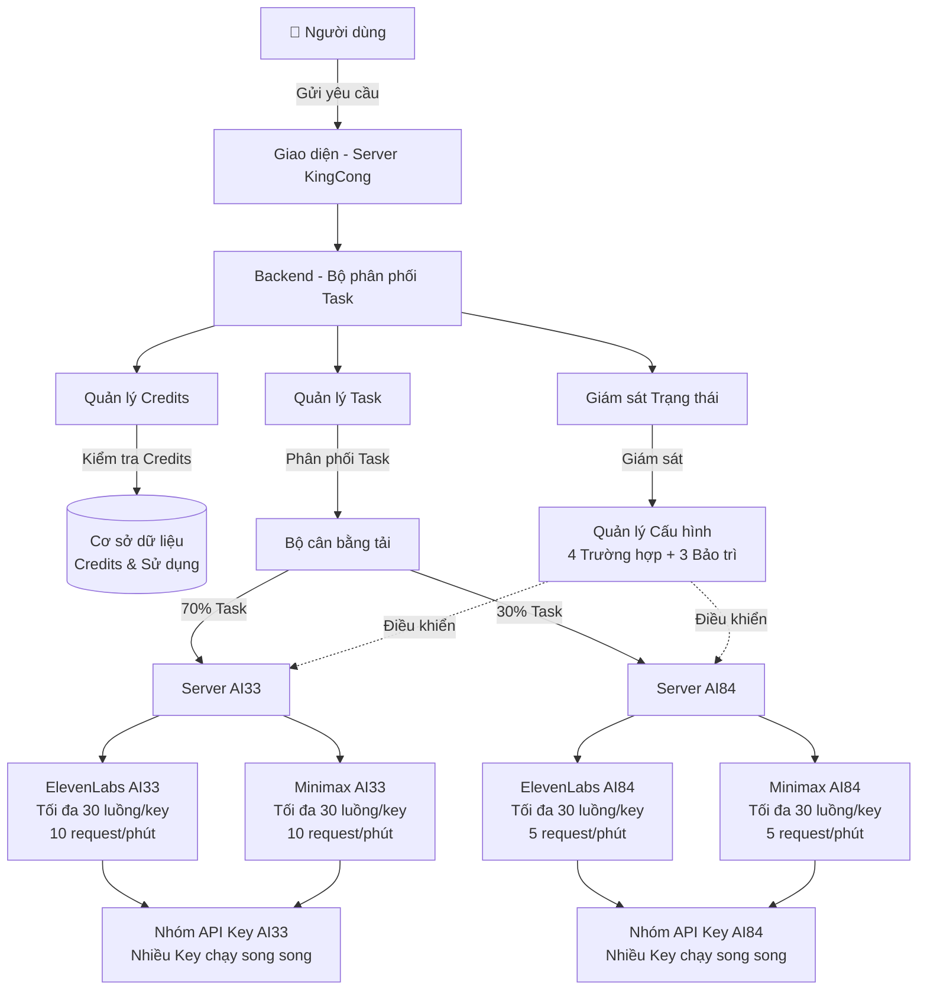
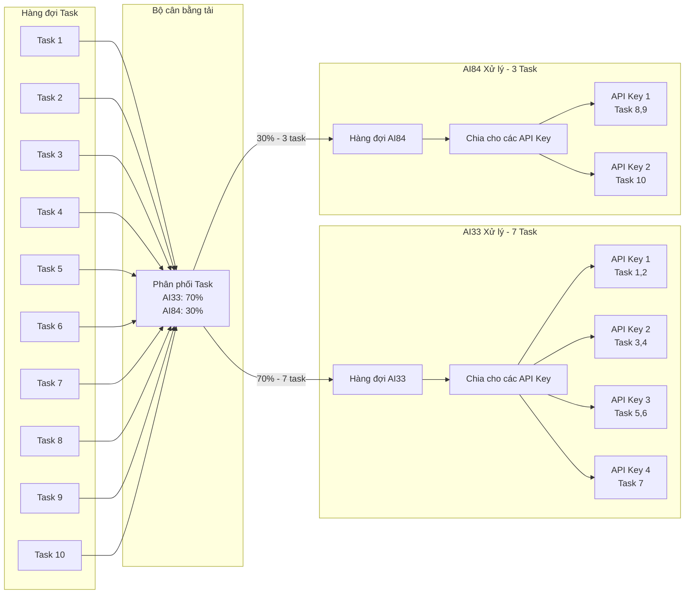
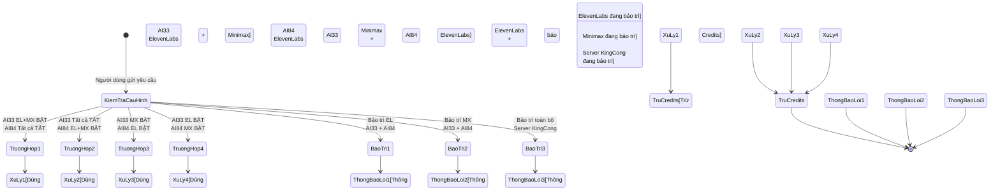
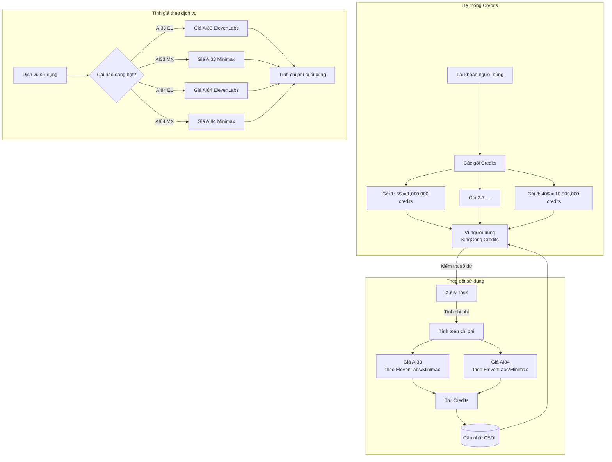
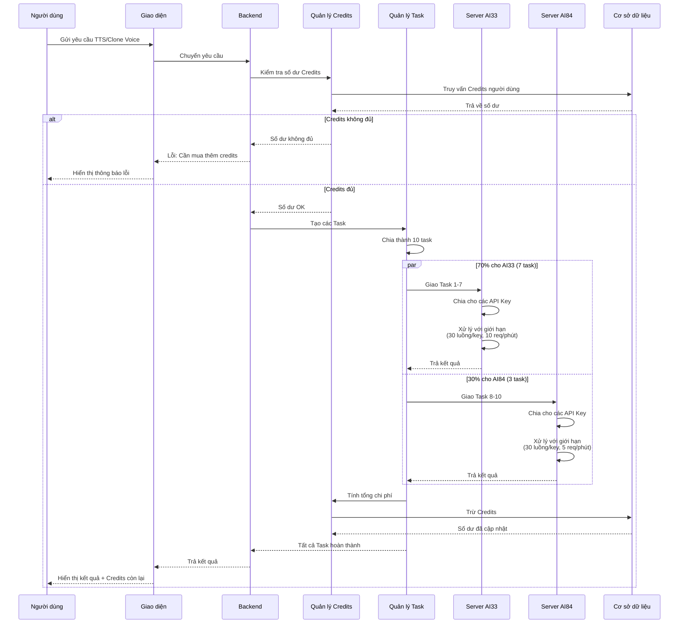

# Sơ đồ Kiến trúc Server KingCong

## 1. Sơ đồ Tổng quan Hệ thống



## 2. Sơ đồ Phân phối Task (Chia việc)



## 3. Sơ đồ Cấu hình 4 Trường hợp + 3 Bảo trì



## 4. Sơ đồ Quản lý Credits



## 5. Sơ đồ Luồng xử lý Yêu cầu



## 6. Cấu trúc Giao diện (Tab)

```
📁 AI Tools Server KingCong
như FE server 1 server 2
```

## 7. Cấu trúc Cơ sở dữ liệu

```sql
-- Bảng Credits người dùng
CREATE TABLE kingcong_credits (
    user_id INT PRIMARY KEY,
    balance BIGINT NOT NULL DEFAULT 0,  -- Số dư hiện tại
    total_purchased BIGINT DEFAULT 0,   -- Tổng đã mua
    total_spent BIGINT DEFAULT 0,       -- Tổng đã tiêu
    created_at TIMESTAMP,
    updated_at TIMESTAMP
);

-- Bảng Giao dịch
CREATE TABLE kingcong_transactions (
    id INT AUTO_INCREMENT PRIMARY KEY,
    user_id INT,
    type ENUM('purchase', 'usage', 'refund'),  -- mua, dùng, hoàn
    amount BIGINT,
    service_used ENUM('ai33_elevenlabs', 'ai33_minimax', 'ai84_elevenlabs', 'ai84_minimax'),
    task_id VARCHAR(255),
    balance_after BIGINT,  -- Số dư sau giao dịch
    created_at TIMESTAMP
);

-- Bảng Cấu hình hệ thống
CREATE TABLE kingcong_config (
    id INT PRIMARY KEY,
    ai33_elevenlabs_active BOOLEAN DEFAULT TRUE,   -- AI33 EL bật/tắt
    ai33_minimax_active BOOLEAN DEFAULT TRUE,      -- AI33 MX bật/tắt
    ai84_elevenlabs_active BOOLEAN DEFAULT FALSE,  -- AI84 EL bật/tắt
    ai84_minimax_active BOOLEAN DEFAULT FALSE,     -- AI84 MX bật/tắt
    maintenance_mode ENUM('none', 'elevenlabs', 'minimax', 'full') DEFAULT 'none',
    task_split_ratio_ai33 INT DEFAULT 70,  -- Tỷ lệ % cho AI33
    task_split_ratio_ai84 INT DEFAULT 30,  -- Tỷ lệ % cho AI84
    updated_at TIMESTAMP
);

-- Bảng Nhóm API Keys
CREATE TABLE kingcong_api_keys (
    id INT AUTO_INCREMENT PRIMARY KEY,
    server ENUM('ai33', 'ai84'),
    service ENUM('elevenlabs', 'minimax'),
    api_key VARCHAR(255),
    is_active BOOLEAN DEFAULT TRUE,        -- Key có đang hoạt động
    current_usage INT DEFAULT 0,           -- Số luồng đang dùng
    max_threads INT DEFAULT 30,            -- Tối đa luồng
    rate_limit_per_min INT,                -- Giới hạn request/phút
    last_used TIMESTAMP                    -- Lần dùng cuối
);

-- Bảng Hàng đợi Task
CREATE TABLE kingcong_tasks (
    id VARCHAR(255) PRIMARY KEY,
    user_id INT,
    status ENUM('pending', 'processing', 'completed', 'failed'),  -- chờ, đang xử lý, hoàn thành, lỗi
    assigned_to ENUM('ai33', 'ai84'),      -- Giao cho server nào
    service ENUM('elevenlabs', 'minimax'), -- Dùng dịch vụ nào
    api_key_id INT,                        -- Key nào đang xử lý
    input_data TEXT,                       -- Dữ liệu đầu vào
    output_data TEXT,                      -- Kết quả đầu ra
    credits_cost BIGINT,                   -- Chi phí credits
    created_at TIMESTAMP,
    completed_at TIMESTAMP
);

-- Bảng Bảng giá dịch vụ
CREATE TABLE kingcong_pricing (
    id INT AUTO_INCREMENT PRIMARY KEY,
    service_name VARCHAR(100),             -- Tên dịch vụ
    server ENUM('ai33', 'ai84'),
    service_type ENUM('elevenlabs', 'minimax'),
    credits_per_character DECIMAL(10, 4),  -- Credits/ký tự
    credits_per_second DECIMAL(10, 4),     -- Credits/giây âm thanh
    is_active BOOLEAN DEFAULT TRUE,
    updated_at TIMESTAMP
);
```

## 8. Logic Backend (Code giả)

```python
class BoPhanPhoBKingCong:
    def __init__(self):
        self.ty_le_ai33 = 0.70  # 70%
        self.ty_le_ai84 = 0.30  # 30%
        self.cau_hinh = self.tai_cau_hinh()
    
    def xu_ly_yeu_cau(self, user_id, du_lieu_yeu_cau):
        # 1. Kiểm tra credits
        if not self.kiem_tra_credits(user_id, du_lieu_yeu_cau):
            return {"loi": "Credits không đủ, vui lòng nạp thêm"}
        
        # 2. Kiểm tra chế độ bảo trì
        if self.cau_hinh.che_do_bao_tri == 'full':
            return {"loi": "Server đang bảo trì, vui lòng thử lại sau"}
        
        # 3. Xác định dịch vụ đang hoạt động
        dich_vu_hoat_dong = self.lay_dich_vu_hoat_dong()
        if not dich_vu_hoat_dong:
            return {"loi": "Không có dịch vụ nào khả dụng"}
        
        # 4. Tạo các task
        cac_task = self.tao_task(du_lieu_yeu_cau)
        
        # 5. Phân phối task
        so_task_ai33 = int(len(cac_task) * self.ty_le_ai33)
        task_ai33 = cac_task[:so_task_ai33]
        task_ai84 = cac_task[so_task_ai33:]
        
        # 6. Xử lý với nhóm API key
        ket_qua = []
        
        if self.cau_hinh.ai33_hoat_dong():
            ket_qua_ai33 = self.xu_ly_ai33(task_ai33, dich_vu_hoat_dong)
            ket_qua.extend(ket_qua_ai33)
        
        if self.cau_hinh.ai84_hoat_dong():
            ket_qua_ai84 = self.xu_ly_ai84(task_ai84, dich_vu_hoat_dong)
            ket_qua.extend(ket_qua_ai84)
        
        # 7. Tính và trừ credits
        tong_chi_phi = self.tinh_chi_phi(ket_qua)
        self.tru_credits(user_id, tong_chi_phi)
        
        return {
            "thanh_cong": True, 
            "ket_qua": ket_qua,
            "credits_da_dung": tong_chi_phi
        }
    
    def xu_ly_ai33(self, cac_task, dich_vu):
        """Xử lý task trên AI33"""
        cac_api_key = self.lay_key_kha_dung('ai33', dich_vu)
        return self.phan_bo_cho_key(
            cac_task, 
            cac_api_key, 
            max_luong=30,      # Tối đa 30 luồng/key
            gioi_han_req=10    # 10 request/phút
        )
    
    def xu_ly_ai84(self, cac_task, dich_vu):
        """Xử lý task trên AI84"""
        cac_api_key = self.lay_key_kha_dung('ai84', dich_vu)
        return self.phan_bo_cho_key(
            cac_task,
            cac_api_key,
            max_luong=30,      # Tối đa 30 luồng/key
            gioi_han_req=5     # 5 request/phút
        )
    
    def phan_bo_cho_key(self, cac_task, cac_api_key, max_luong, gioi_han_req):
        """Phân bổ task cho các API key theo vòng tròn"""
        ket_qua = []
        
        for i, task in enumerate(cac_task):
            # Chọn key theo vòng tròn
            key = cac_api_key[i % len(cac_api_key)]
            
            # Kiểm tra giới hạn request
            if self.kiem_tra_gioi_han(key, gioi_han_req):
                ket_qua_task = self.thuc_thi_task(task, key)
                ket_qua.append(ket_qua_task)
            else:
                # Đưa vào hàng đợi hoặc dùng key khác
                ket_qua_task = self.xu_ly_khi_vuot_gioi_han(task, cac_api_key)
                ket_qua.append(ket_qua_task)
        
        return ket_qua
    
    def tinh_chi_phi(self, ket_qua):
        """Tính tổng chi phí credits"""
        tong = 0
        for kq in ket_qua:
            if kq['dich_vu'] == 'ai33_elevenlabs':
                tong += kq['so_ky_tu'] * self.gia_ai33_el
            elif kq['dich_vu'] == 'ai33_minimax':
                tong += kq['so_ky_tu'] * self.gia_ai33_mx
            elif kq['dich_vu'] == 'ai84_elevenlabs':
                tong += kq['so_ky_tu'] * self.gia_ai84_el
            elif kq['dich_vu'] == 'ai84_minimax':
                tong += kq['so_ky_tu'] * self.gia_ai84_mx
        return tong
    
    def tru_credits(self, user_id, so_tien):
        """Trừ credits từ tài khoản người dùng"""
        # Cập nhật database
        db.cap_nhat(
            "UPDATE kingcong_credits SET balance = balance - %s WHERE user_id = %s",
            (so_tien, user_id)
        )
        
        # Ghi log giao dịch
        db.them(
            "INSERT INTO kingcong_transactions (user_id, type, amount) VALUES (%s, 'usage', %s)",
            (user_id, so_tien)
        )
```

## 9. Các trường hợp cụ thể

### Trường hợp 1: AI33 ElevenLabs BẬT, AI33 Minimax BẬT, AI84 Tất cả TẮT
```
Luồng xử lý:
1. Nhận 10 task từ người dùng
2. Phân bổ: 7 task → AI33, 3 task → AI84 (nhưng AI84 tắt)
3. AI33 xử lý cả 10 task
4. AI33 chia 10 task cho nhiều API key ElevenLabs và Minimax
5. Tính credits theo giá AI33
```

### Trường hợp 2: AI33 Tất cả TẮT, AI84 ElevenLabs BẬT, AI84 Minimax BẬT
```
Luồng xử lý:
1. Nhận 10 task từ người dùng
2. Phân bổ: 7 task → AI33 (nhưng tắt), 3 task → AI84
3. AI84 xử lý cả 10 task
4. AI84 chia 10 task cho nhiều API key ElevenLabs và Minimax
5. Tính credits theo giá AI84
```

### Trường hợp 3: AI33 Minimax BẬT, AI84 ElevenLabs BẬT
```
Luồng xử lý:
1. Nhận 10 task từ người dùng
2. Phân loại task: Task nào cần ElevenLabs? Task nào cần Minimax?
3. Task ElevenLabs → AI84 xử lý
4. Task Minimax → AI33 xử lý
5. Tính credits hỗn hợp (AI33 cho Minimax, AI84 cho ElevenLabs)
```

### Trường hợp 4: AI33 ElevenLabs BẬT, AI84 Minimax BẬT
```
Luồng xử lý:
1. Nhận 10 task từ người dùng
2. Phân loại task: Task nào cần ElevenLabs? Task nào cần Minimax?
3. Task ElevenLabs → AI33 xử lý
4. Task Minimax → AI84 xử lý
5. Tính credits hỗn hợp (AI33 cho ElevenLabs, AI84 cho Minimax)
```

---

## 10. Checklist triển khai

### Backend
- [ ] Tạo bảng cơ sở dữ liệu (7 bảng)
- [ ] Xây dựng API endpoint cho mua credits
- [ ] Xây dựng API endpoint cho Text-to-Speech
- [ ] Xây dựng API endpoint cho Voice Cloning
- [ ] Viết logic phân phối task (70-30)
- [ ] Viết logic quản lý API key pool
- [ ] Viết logic kiểm tra rate limit
- [ ] Viết logic tính toán credits
- [ ] Viết logic xử lý 4 trường hợp + 3 bảo trì
- [ ] Viết cron job theo dõi trạng thái server

### Frontend
- [ ] Tạo tab "AI Tools Server KingCong"
- [ ] Tạo tab con "Mua Credits" với 8 gói
- [ ] Tạo tab con "Text To Speech"
- [ ] Tạo tab con "Voice Cloning"
- [ ] Hiển thị thanh trạng thái (Credits, AI33, AI84)
- [ ] Hiển thị thông báo bảo trì
- [ ] Tích hợp thanh toán
- [ ] Hiển thị lịch sử giao dịch

### Kiểm thử
- [ ] Test phân phối 70-30
- [ ] Test rate limit AI33 (10 req/phút)
- [ ] Test rate limit AI84 (5 req/phút)
- [ ] Test cả 4 trường hợp hoạt động
- [ ] Test cả 3 chế độ bảo trì
- [ ] Test tính credits chính xác
- [ ] Test xử lý khi credits không đủ
- [ ] Load test với 100+ task đồng thời

### Admin Panel (Khuyến nghị)
- [ ] Bật/tắt AI33 ElevenLabs
- [ ] Bật/tắt AI33 Minimax
- [ ] Bật/tắt AI84 ElevenLabs
- [ ] Bật/tắt AI84 Minimax
- [ ] Chuyển chế độ bảo trì
- [ ] Điều chỉnh tỷ lệ phân phối (70-30)
- [ ] Thêm/xóa API key
- [ ] Xem thống kê sử dụng
- [ ] Xem logs lỗi

---

## Tổng kết

### Ưu điểm của kiến trúc này:
✅ **Linh hoạt**: 4 trường hợp + 3 bảo trì đáp ứng mọi tình huống  
✅ **Tối ưu tốc độ**: Chia task cho nhiều API key chạy song song  
✅ **Cân bằng tải**: 70-30 có thể điều chỉnh theo nhu cầu  
✅ **Tiết kiệm chi phí**: Tự quản lý credits, không phụ thuộc AI33/AI84  
✅ **Dễ mở rộng**: Thêm server AI mới chỉ cần thêm cấu hình  
